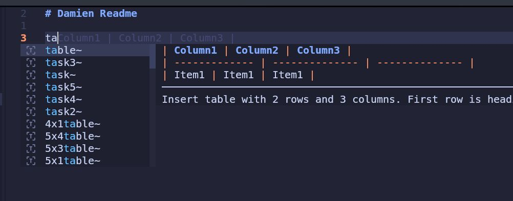

# Damien Readme

I am trying to figure out how to turn off the snippet suggestions in markdown files. 

I am quite surprised at how long I've tried to do this, and how badly I've failed! It's now become so much more than me trying to solve this task, but more about me learning lazyvim / neovim. 

This project is a direct clone of the lazyvim starter with minimal changes. 

[This Post](https://www.reddit.com/r/neovim/comments/18d2vad/how_to_disable_the_snippet_window_neovim_lazyvim/) seems close. 

Which links to [here](https://github.com/hrsh7th/nvim-cmp/blob/0b751f6beef40fd47375eaf53d3057e0bfa317e4/doc/cmp.txt#L956-L969)
That lead me to the changes I've recorded ~/.config/nvim/lua/plugins/example.lua

